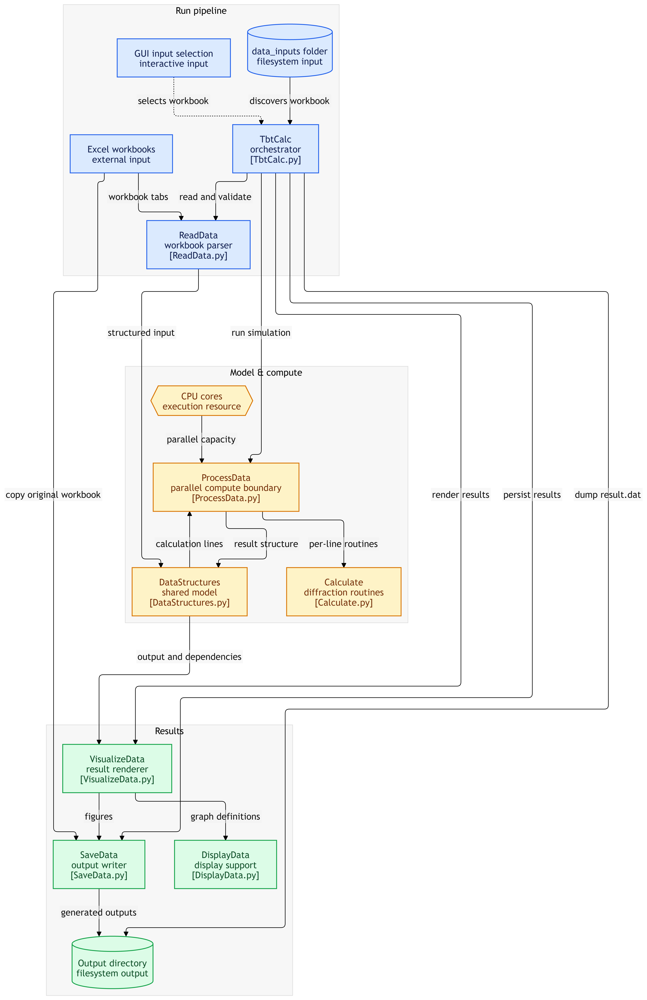

# Self Imaging
TbtCalc is a Python script for simulating grating diffraction by grating.
This is a standalone Python simulator for Fresnel/Talbot-style self-imaging: it models diffraction from 1D/2D amplitude or phase gratings onto a position-sensitive detector (PSD). The interactive/batch entry point is `FresnelDiffraction/TbtCalc.py`, which orchestrates input acquisition, computation, visualization, and persistence.

## Description of files/directory structure 

The source code folder `FresnelDiffraction` consists of a collection of python files (`*.py`-files), an accompanying input data files (provided as `.xlsx` files) are in `input_examples` folder.

The source code files are further described below. To set up a simulation, an input `TbtCalc` script must be started which allows to enter input data either via GUI or from `data_inputs` folder if it in the same folder with `TbtCalc` script. The input parameters are read from the “Grating”, “Beam”, “Beam.X”, “Beam.Y”, “Psd”, “Add” and "Dependencies" tabs of the Excel file and are organized structlike columns on the basis of `OutputData` structure. At the start of program execution, the input data file `<filename>.xlsx` is copied into the otput folder where calculation result will be saved as `result.dat` file also.

Example of Excel spreadsheets are given in `input_examples` folder.

## Scripts of core functionalities located in the `FresnelDiffraction` folder: 

- `TbtCalc.py`: main script, that provides core functionality steps: data reading, calculation, visualization and saving output data.  
  - `DataStructures.py`: support file, where all data structures are described.
  - `Calculate.py`: support function file, with specific calculations used withing data reading procedure or during data processing.
- `ReadData.py`: function, used for reading input data files and forming input data structures, that are used as input parameters for simulations. This script is used to read Excel-based spreadsheet (examples are present in `inputs_example` folder).  
- `ProcessData.py`: main program function, where program parameters are provided as inputs along with several supporting functions. Can be used separately by providing correct input data structures with command `result = ProcessData.fromStructure(input)`. Note, data processing is done in parallel on the basis of system device number of cores, and input structures are divided to contain all needed data within one dataline: this would allow parallelization process.    
- `VisualizeData.py`: python function, used for output data visualization.  
  - `DisplayData.py`: support file, where all data used graphs are described.
- `SaveData.py`: python function, used for output data saving. Note, output structure is dumped in `result.dat` separately within main program `TbtCalc.py`. 

#### General program structure

### Input and Data Model

Excel workbooks define one or more simulation data lines, including grating, beam, PSD, and calculation controls. `FresnelDiffraction/ReadData.py` parses those sheets into structured simulation inputs defined in `FresnelDiffraction/DataStructures.py`. Example experiment definitions are `input_examples/distanceDependency_cos_amp.xlsx` and `input_examples/distanceDependency_square_amp.xlsx`.
The central output model carries validation state, messages, copied/common parameters, per-line results, timing, output locations, and visualization dependencies.

#### Structure description `OutputData`:

* `is_ok` used to mark out that all mandatory data present (`boolean`)  
* `message` field used to store error message, must be empty at start of calculation (`string`)  
* `io` structure contains following fields  
  * `date`:  calculation date/time (`string`) 
  * `filedir`:   path to output file (`string`)  
  * `workdir`:   path to output folder, can be different form `filedir`, if several files are opened (`string`)
  * `filename`:   data file name (`string`)  
  * `outputfile`:   full path to the output data file (`string`)
* `copy_data` structure prepared to process data (`CopyData`)  
* `copy_beam` indicates if all data lines use the same beam parameters (`boolean`)
* `copy_beam_band` indicates if all data lines use the same beam band parameters (`boolean`)
* `copy_grating` indicates if all data lines use the same grating parameters (`boolean`)
* `data` data line array of structures (`OutputDataLine`)  
  * `is_ok` used to mark out that all mandatory data present (`boolean`)  
  * `message` field used to store error message, must be empty at start of calculation (`string`)  
  * `grating` structure contains following fields  
    * `slit`:  grating slit description (`string` with three mandatory words)
      * grating form factor:  `1D` or `2D`
      * grating transmission:  `amplitude` or `phase`
      * pit structure:  
        * `square` - binary grating, 
        * `cos` - cosine-like grating, 
        * `lens` - used to simulate Shack-Hartmann wavefront sensor 
    * `period`:   period of the grating (`number`)  
    * `duty_factor`:   grating duty factor (`number`)
    * `depth`:   slit depth to be used for phase grating (`number`)  
    * `index`:   material index of refraction ([`number`, `number`] where value with index 1 is used in case of achromatic illumiation)
    * `phase_depth`:  phase depth calculated on the basis index of refraction and illumination wavelength (`number`)
    * `coefficients`:  field reserved for fourier coefficients (`None`)
  * `beam` structure contains following fields  
    * `wavelength`:  beam wavelength (`number`) 
    * `intensity`:  beam intensity, used for output data visualization (`number`)  
    * `angle`:  incidence angle (2D structure: `number`.`x`, `number`.`y`)  
    * `curvature`:  wavefront curvature (2D structure: `number`.`x`, `number`.`y`)
    * `waist`:  gaussian beam inverted radius  (2D structure: `number`.`x`, `number`.`y`)
    * `aperture`:  beam inverted aperture (2D structure: `number`.`x`, `number`.`y`)
    * `band`:  beam bandwidth (`number`)
    * `aberration`:  !not implemented! aberrations (2D structure: `number`.`x`, `number`.`y`)
    * `coefficients`:  !not implemented! field reserved for fourier coefficients (`None`)
  * `psd` structure contains following fields  
    * `distance`:  grating to PSD distance (`number`)  
    * `aperture`:  measurement aperture of PSD (`number`)
    * `step`:  lateral coordinate separation (`number`)
    * `div_factor`:  division parameter used to simulate result averaging by the measurement system (`number`)  
  * `add` structure contains following fields  
    * `accuracy`:  accuracy value for fourier analysis (`number`)  
    * `dependency`:  planed for a future usage (`number`)
    * `debug`:  indicator used to save internal data (`boolean`)
    * `save`:   indicator used to save generated figures (`boolean`)
  * `dependencies` planed for a future usage (`None`)
  * `start` calculation start time (`None`)
  * `end` calculation finish time (`None`)
* `dependencies` list of dependencies for visualization (`boolean`)

### Simulation Preparation

`FresnelDiffraction/ProcessData.py` is the reusable processing API (`ProcessData.fromStructure(input)`) and validation/preparation boundary. It accepts populated structures rather than directly depending on Excel, allowing callers other than the main script. It derives calculation-ready grating and beam properties, including phase depth and Fourier-related coefficients, using `FresnelDiffraction/Calculate.py`.

### Diffraction Computation

The computation stage processes each independent input data line, modeling grating transmission, incident beam properties, propagation distance, sampling aperture/step, and detector averaging (`div_factor`). Supported grating definitions include 1D/2D, amplitude/phase, square/cosine/lens structures. Core numerical logic is split between `FresnelDiffraction/ProcessData.py` and `FresnelDiffraction/Calculate.py`.

### Parallel Execution Boundary

Processing is explicitly parallelized across available system CPU cores. Input structures are arranged so each data line contains the parameters required for independent execution; this is the primary concurrency boundary in `FresnelDiffraction/ProcessData.py`. Cross-line common beam, beam-band, and grating values can be represented as copied/shared output metadata rather than requiring coupled calculation.

### Visualization and Output

`FresnelDiffraction/VisualizeData.py` converts computed result structures into figures, with graph/display definitions centralized in `FresnelDiffraction/DisplayData.py`. Visualization is downstream of numerical processing and can be controlled per input line through save/debug options.

`FresnelDiffraction/SaveData.py` persists generated outputs. The orchestrator also writes the full result structure as `result.dat`; the source workbook is copied into the run output directory. File and working-directory metadata are retained in the result model.

### Runtime and External Dependencies

The runtime is local Python with filesystem access and Excel workbook input; no server, database, or cloud service is indicated. Material external requirements are spreadsheet-reading support, numerical/Fourier computation, CPU multiprocessing, plotting/display support, and binary/object serialization for `result.dat`.

### Installation instructions 

Included Python scripts do not require any installation, just copy to the working folder.

## Example of input data files located in the `input_examples` folder: 

`distanceDependency_cos_amp.xlsx`: Basic file used to simulate distance dependency for cosine-like amplitude grating  
`distanceDependency_square_amp.xlsx`: File used to simulate grating to sample distance effect for binary amplitude grating 

